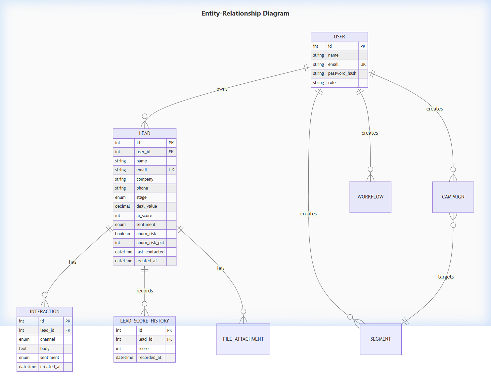
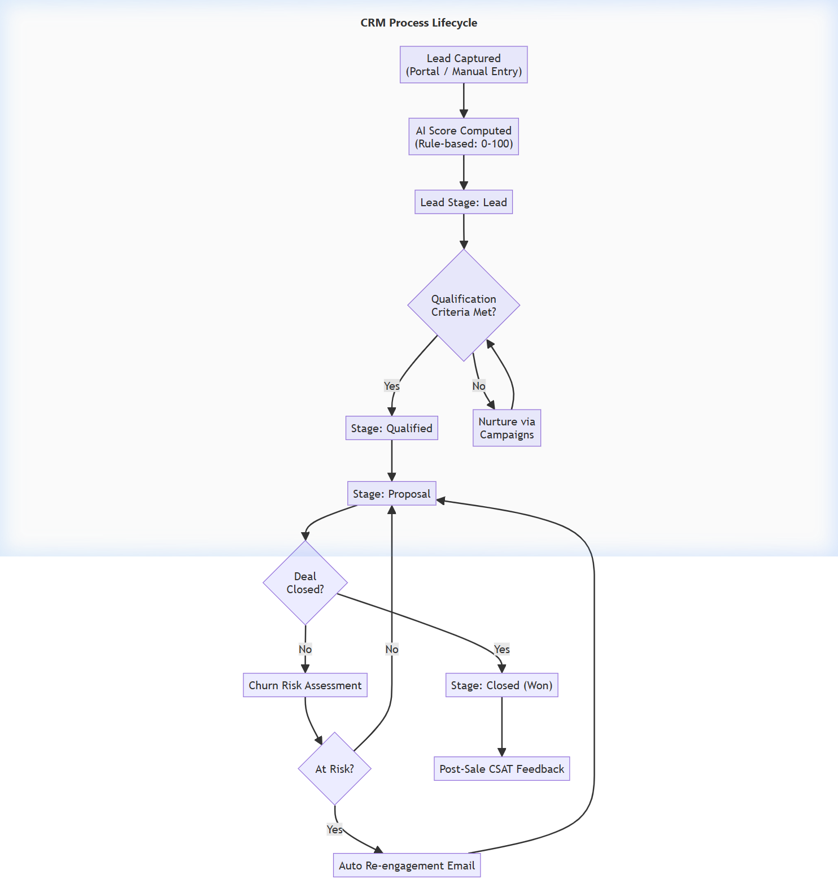
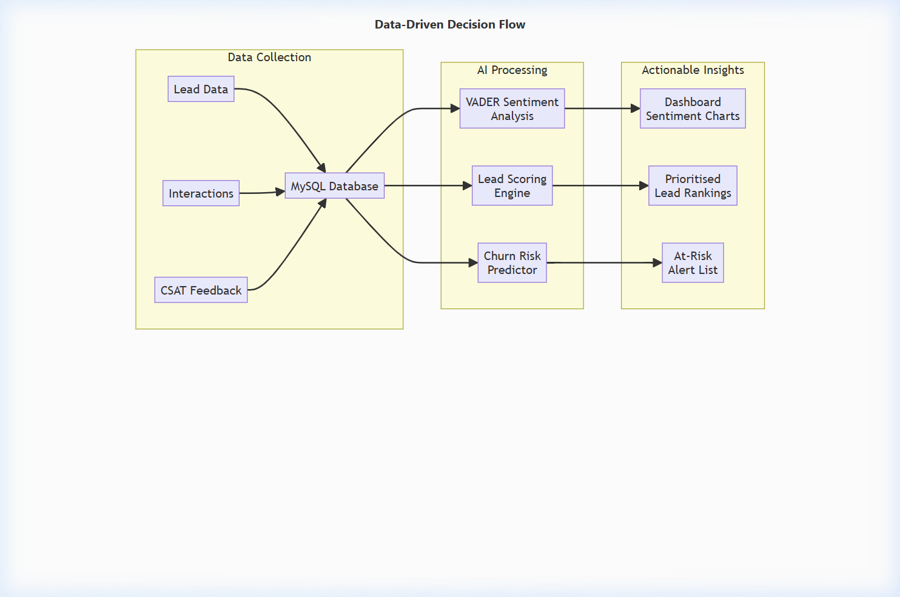
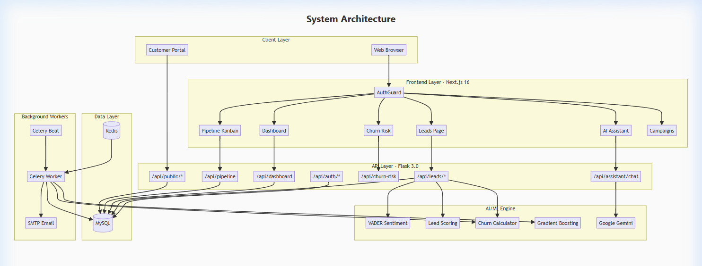
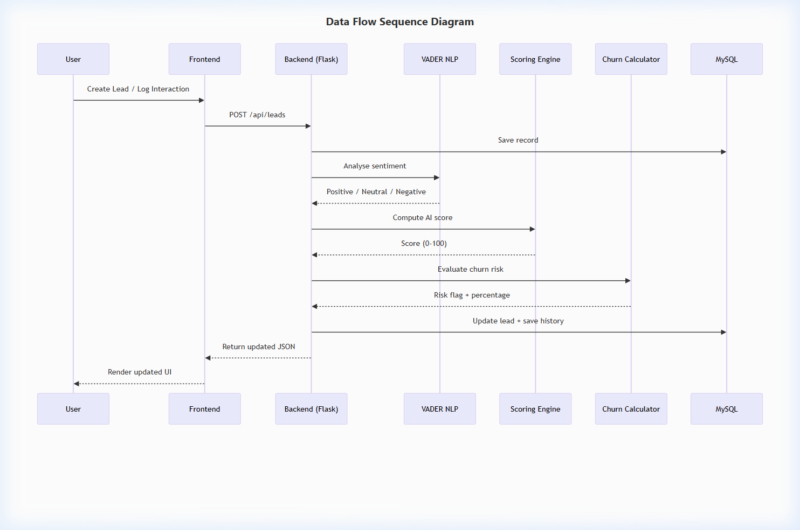
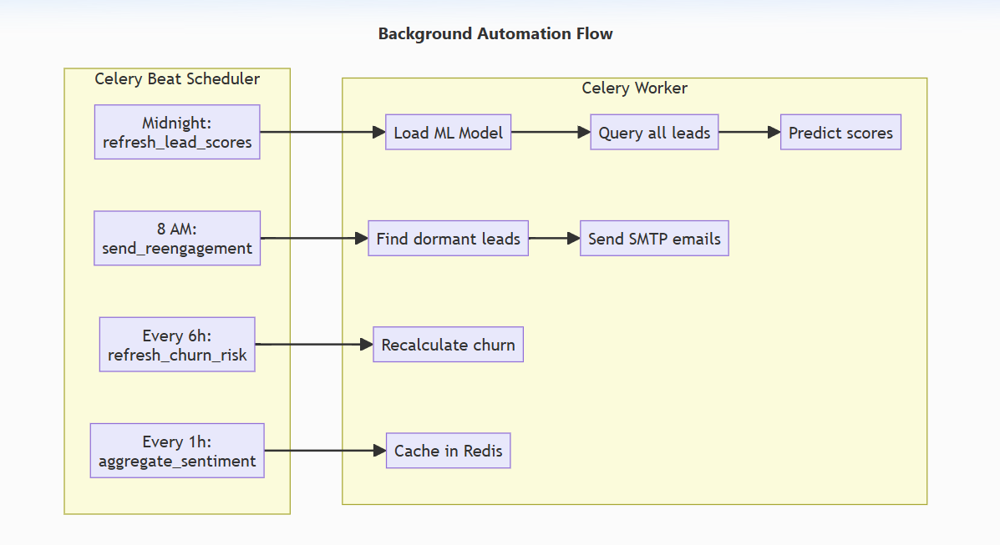
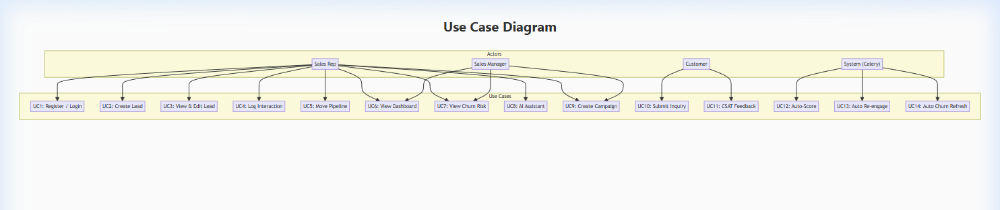

# NexCRM — AI-Powered Customer Relationship Management System

# **Project Report**

---

---

# UNIT IV — CRM Planning, Strategy & Services

---

## 1. Project Title

**NexCRM — An AI-Powered Customer Relationship Management System with Predictive Lead Scoring, Sentiment Analysis, and Automated Churn Prevention**

---

## 2. Introduction

In today's fiercely competitive business environment, managing customer relationships effectively is the difference between growth and stagnation. Traditional CRM systems function as passive record-keeping tools — they store contacts and log interactions but offer no intelligence about *which* leads to prioritise, *when* a customer is about to leave, or *what* sentiment a conversation carries.

**NexCRM** is a next-generation, AI-powered CRM platform built to solve these problems. It combines a modern web-based interface (Next.js) with a powerful Python backend (Flask) augmented by machine learning (scikit-learn Gradient Boosting), natural language processing (VADER Sentiment Analysis), and a conversational AI assistant (Google Gemini). The system automatically scores every lead on a 0–100 scale, classifies interaction sentiment in real time, predicts churn risk, and sends automated re-engagement emails to dormant accounts — all without manual intervention.

The platform is designed for small-to-medium sales teams who need actionable intelligence, not just data entry. Every CRM action — creating a lead, logging a call, moving a deal through the pipeline — triggers an instant AI re-evaluation, ensuring that dashboards and priority lists always reflect the latest reality.

NexCRM also features a customer-facing portal for lead submission and CSAT feedback collection, campaign management with audience segmentation, workflow automation with configurable triggers, and a Kanban-style sales pipeline with drag-and-drop capability.

---

## 3. Problem Statement

Small and medium-sized businesses frequently rely on spreadsheets or basic CRM tools to manage their sales pipeline. These tools suffer from several critical limitations:

1. **No Predictive Intelligence**: Sales representatives manually guess which leads are most promising. There is no data-driven scoring mechanism, resulting in wasted effort on low-probability prospects and neglect of high-value opportunities.

2. **Blind Spot on Customer Sentiment**: When a sales rep exchanges dozens of emails and call notes, the overall sentiment trajectory of a customer relationship is invisible. A customer may be gradually turning negative, but without automated analysis, the team only realises this after the deal is lost.

3. **Reactive Churn Management**: Most organisations only discover a customer has churned *after* they stop responding. There is no early warning system that flags accounts going dormant or trending negative, which means re-engagement happens too late.

4. **Manual, Repetitive Workflows**: Tasks like sending follow-up emails to dormant leads, recalculating priorities, and generating reports are performed manually, consuming productive selling time.

These gaps lead to lost revenue, poor customer retention, and inefficient allocation of sales resources.

---

## 4. Objectives

1. **To design and develop an AI-powered CRM system** that automatically scores leads, analyses customer sentiment, and predicts churn risk in real time — enabling data-driven sales prioritisation without manual intervention.

2. **To implement automated background workflows** (using Celery and Redis) for nightly score recalculation, periodic churn risk assessment, and dormant lead re-engagement email campaigns — reducing repetitive manual tasks for sales teams.

---

## 5. Goals (Based on Objectives)

### Goals for Objective 1 — AI-Powered Intelligence

| # | Goal | Measurable Outcome |
|---|------|--------------------|
| G1 | Implement a rule-based and ML-based lead scoring engine | Every lead receives an AI score (0–100) computed from stage, deal value, sentiment, recency, and interaction volume |
| G2 | Integrate VADER NLP-based sentiment analysis | Every interaction (email, chat, call, note) is automatically classified as Positive, Neutral, or Negative |
| G3 | Build a churn risk prediction module | At-risk leads are flagged with a risk percentage (0–100%) based on dormancy, sentiment, and score |
| G4 | Deploy a Gemini-powered AI sales assistant | Users can query live CRM data conversationally (e.g., "Who are my top 5 leads?") |
| G5 | Provide a real-time analytics dashboard | KPIs (pipeline value, conversion rate, at-risk count), sentiment distribution, and top-lead rankings are updated on every page load |

### Goals for Objective 2 — Automated Workflows

| # | Goal | Measurable Outcome |
|---|------|--------------------|
| G6 | Schedule nightly AI score refresh via Celery Beat | All lead scores are recalculated using the ML model every night at midnight |
| G7 | Automate churn risk recalculation every 6 hours | Churn flags are refreshed periodically without manual admin intervention |
| G8 | Implement automated re-engagement emails | Dormant leads (30+ days no contact) receive a templated re-engagement email via SMTP |
| G9 | Cache sentiment trend aggregations in Redis | Weekly sentiment distribution data is pre-computed hourly for instant dashboard rendering |

---

## 6. CRM Planning

### 6.1 Stakeholder Identification

| Stakeholder | Role in NexCRM |
|-------------|---------------|
| Sales Representatives | Primary users — manage leads, log interactions, move pipeline stages |
| Sales Managers / Directors | View dashboards, monitor team KPIs, identify at-risk accounts |
| Marketing Team | Create campaigns, define audience segments, track engagement |
| Customers / Prospects | Submit inquiries via the Customer Portal, provide CSAT feedback |
| System Administrator | Manage user accounts, trigger manual score refreshes, configure SMTP |

### 6.2 CRM Data Planning

The CRM data architecture is centred around four core entities:

### 6.3 CRM Process Planning

The core CRM lifecycle managed by NexCRM follows this flow:

### 6.4 Technology Planning

| Layer | Technology | Purpose |
|-------|-----------|---------|
| Frontend | Next.js 16, React 18, TypeScript | Interactive UI, SPA with SSR support |
| Backend | Flask 3.0, SQLAlchemy | REST API, ORM, business logic |
| Database | MySQL (InnoDB) | Persistent storage with referential integrity |
| Task Queue | Celery 5.4 + Redis 5.0 | Background AI tasks, scheduled jobs |
| NLP | VADER Sentiment Analyzer | Real-time sentiment classification |
| ML | scikit-learn (Gradient Boosting) | Batch lead scoring model |
| AI Chat | Google Gemini (gemini-2.5-flash) | Conversational CRM assistant |
| Email | SMTP (configurable) | Automated re-engagement emails |

---

## 7. CRM Strategy

### 7.1 Customer Acquisition Strategy

NexCRM supports customer acquisition through:

- **Customer Portal** (`/customer-portal`): A public-facing page where prospects can submit their name, email, company, and a message. This auto-creates a lead in the CRM with an initial AI score and sentiment analysis on the submitted message.
- **API-first lead creation**: External marketing tools, landing pages, and web forms can push leads via `POST /api/public/leads`.
- **Campaign Management**: Sales teams can create email/SMS campaigns targeted at specific audience segments (e.g., "High-value leads in Proposal stage with Positive sentiment").

### 7.2 Customer Retention Strategy

Churn prevention is a core pillar of NexCRM's strategy:

| Strategy | Implementation |
|----------|---------------|
| **Early Warning System** | Churn risk is computed from dormancy days + negative sentiment + low AI score. Leads with risk ≥ 50% are flagged. |
| **Automated Re-engagement** | Celery Beat schedules morning checks for dormant leads (30+ days). An HTML re-engagement email is automatically sent. |
| **Sentiment Monitoring** | Every interaction is analysed by VADER. A shift from Positive to Negative triggers a score drop and churn flag. |
| **Next-Best-Action Suggestions** | Each lead card displays a context-aware recommended action (e.g., "Schedule check-in call to address concerns" for a Qualified lead with Negative sentiment). |

### 7.3 Customer Engagement Strategy

- **AI Sales Assistant**: The Gemini-powered chatbot has real-time access to all CRM data. Sales reps can ask questions like "Which leads should I call today?" and receive prioritised, context-aware answers.
- **Interaction Logging**: Every email, call, chat, and note is logged with automatic sentiment tagging, building a rich engagement history per lead.
- **Pipeline Kanban Board**: A drag-and-drop visual pipeline (`/pipeline`) gives teams an at-a-glance view of deal flow, with AI scores and values on every card.

### 7.4 Data-Driven Decision Strategy

---

## 8. CRM Marketing

### 8.1 Campaign Management

NexCRM includes a full campaign management module:

- **Campaign Creation** (`/campaigns`): Users define campaigns with a name, subject line, HTML body, and delivery type (Email or SMS).
- **Audience Segmentation** (`/api/segments`): Users create reusable segments using rule-based JSON filters (e.g., stage = "Qualified" AND sentiment = "Positive"). Campaigns are linked to segments for targeted delivery.
- **Campaign Lifecycle**: Each campaign moves through three statuses — **Draft → Scheduled → Sent**.

### 8.2 Lead Nurturing via Automation

| Automation | Trigger | Action |
|------------|---------|--------|
| Re-engagement Email | Lead dormant > 30 days | Send personalized HTML email with CTA |
| Score Refresh | Nightly (Celery Beat) | Recalculate all AI scores using ML model |
| Churn Alert | Every 6 hours | Flag newly at-risk leads |
| Sentiment Trends | Hourly | Aggregate weekly sentiment data to Redis cache |

### 8.3 Marketing Analytics

The dashboard provides marketing-relevant KPIs:

- **Conversion Rate**: Percentage of total leads that reached "Closed" stage.
- **Sentiment Distribution**: Visual breakdown of Positive / Neutral / Negative across all leads.
- **Pipeline Value**: Total deal value of active (non-closed) leads.
- **Forecasted Value**: Weighted pipeline value based on win probability.

### 8.4 Customer Feedback Loop

The **Feedback Portal** (`/feedback`) allows customers to submit:
- A **CSAT rating** (1–5 stars)
- **Free-text comments**

The system runs sentiment analysis on the comments and attaches the feedback as an interaction to the matching lead. This closes the marketing feedback loop — campaign → acquisition → engagement → feedback → improved targeting.

---

## 9. CRM Services

### 9.1 Sales Support Services

| Service | Description |
|---------|-------------|
| **Lead Management** | Full CRUD for leads with filtering by stage, sentiment, and tags. Search, sort by AI score, deal value, or creation date. |
| **Pipeline Management** | Visual Kanban board with 4 stages (Lead → Qualified → Proposal → Closed). Drag-and-drop moves instantly recalculate AI score and churn risk. |
| **Contact Management** | Detailed contact view with interaction timeline, file attachments, AI score history chart, and editable profile. |
| **AI-Powered Scoring** | Dual-path scoring: real-time rule-based scoring on every user action + nightly ML-based batch scoring using Gradient Boosting. |

### 9.2 Customer Service Features

| Service | Description |
|---------|-------------|
| **Customer Portal** | Self-service lead submission form for prospects |
| **CSAT Feedback** | Post-sale satisfaction survey with star rating and comments |
| **Sentiment Tracking** | Automatic NLP analysis of every customer touchpoint |
| **Next-Best-Action** | AI-generated recommended action for each lead based on stage and sentiment |

### 9.3 Analytical Services

| Service | Description |
|---------|-------------|
| **Executive Dashboard** | KPI cards (pipeline value, closed value, conversion rate, at-risk count), sentiment pie chart, top 5 leads, at-risk lead list |
| **Churn Risk Radar** | Dedicated page listing all at-risk accounts sorted by risk percentage, with dormancy days and value-at-risk |
| **Lead Score History** | Time-series chart tracking how each lead's AI score has evolved over time |
| **Stage Distribution** | Breakdown of leads across pipeline stages |

### 9.4 AI & Automation Services

| Service | Description |
|---------|-------------|
| **AI Sales Assistant** | Gemini-powered conversational chatbot with live CRM context. Answers queries about leads, suggests priorities, and provides sales coaching. |
| **Workflow Automation** | User-defined workflows with configurable triggers (e.g., "stage_change", "time_delay") and action sequences stored as JSON. |
| **Background Processing** | Celery workers handle heavy AI computations asynchronously — score refresh, churn recalculation, email dispatch, trend aggregation. |
| **Automated Email Campaigns** | SMTP-based email sending with branded HTML templates for re-engagement and marketing campaigns. |

---

---

# UNIT V — Technology, Architecture & Results

---

## 1. Technology Stack

### 1.1 Frontend

| Technology | Version | Purpose |
|-----------|---------|---------|
| **Next.js** | 16.2.2 | React meta-framework with file-based routing, SSR/SSG |
| **React** | 18.x | Component-based UI library |
| **TypeScript** | 5.x | Type-safe JavaScript |
| **FormKit Auto-Animate** | 0.9.x | Smooth list animations for lead tables and pipeline |
| **CSS (Custom)** | — | Global design system with dark theme, glassmorphism, CSS variables |

**Key Frontend Pages:**

| Page | Route | Function |
|------|-------|----------|
| Dashboard | `/` | KPIs, charts, top leads, at-risk list |
| Leads | `/leads` | Lead table with filters, search, CRUD modals |
| Contacts | `/contacts` | Detailed contact view with interaction timeline |
| Pipeline | `/pipeline` | Drag-and-drop Kanban board |
| Churn Risk | `/churn` | At-risk accounts with risk % bars |
| AI Assistant | `/assistant` | Conversational AI chat interface |
| Campaigns | `/campaigns` | Campaign creation and management |
| Workflows | `/workflows` | Automation workflow builder |
| Customer Portal | `/customer-portal` | Public lead submission form |
| Feedback | `/feedback` | CSAT rating and comments form |
| Login | `/login` | Authentication (login + registration) |

### 1.2 Backend

| Technology | Version | Purpose |
|-----------|---------|---------|
| **Flask** | 3.0.3 | Lightweight Python web framework for REST API |
| **Flask-SQLAlchemy** | 3.1.1 | ORM for database models and queries |
| **Flask-CORS** | 4.0.0 | Cross-Origin Resource Sharing |
| **PyMySQL** | 1.1.1 | MySQL database driver |
| **Celery** | 5.4.0 | Distributed task queue for background AI jobs |
| **Redis** | 5.0.7 | Message broker for Celery + cache store |
| **VADER Sentiment** | 3.3.2 | Lexicon-based sentiment analysis (NLP) |
| **scikit-learn** | ≥ 1.5.0 | Gradient Boosting ML model for lead scoring |
| **NumPy** | ≥ 1.26.4 | Numerical computations for feature engineering |
| **Google Generative AI** | ≥ 0.8.3 | Gemini API for AI sales assistant |
| **Gunicorn** | 22.0.0 | Production WSGI server |
| **Werkzeug** | (via Flask) | Password hashing (bcrypt-based) |

### 1.3 Database

| Component | Details |
|-----------|---------|
| **RDBMS** | MySQL with InnoDB engine |
| **Character Set** | utf8mb4 (full Unicode support) |
| **Collation** | utf8mb4_unicode_ci |
| **Tables** | `users`, `leads`, `interactions`, `lead_score_history`, `file_attachments`, `segments`, `campaigns`, `workflows` |
| **Indexes** | `idx_stage`, `idx_ai_score (DESC)`, `idx_churn`, `idx_user_id`, `idx_lead_id`, `idx_recorded_at` |

---

## 2. Methodology / Architecture Diagram

### 2.1 Overall System Architecture

### 2.2 Data Flow Architecture

### 2.3 Background Automation Flow

---

## 3. Use Case Diagrams

### 3.1 Primary Use Case Diagram

### 3.2 Use Case Descriptions

| Use Case | Actor | Description | Trigger |
|----------|-------|-------------|---------|
| **UC1**: Register/Login | Sales Rep | User registers with name/email/password or logs in with credentials | User opens the application |
| **UC2**: Create Lead | Sales Rep | Enter lead details (name, email, company, deal value, stage). AI score and churn risk are auto-computed. | Click "New Lead" button |
| **UC3**: View & Edit Lead | Sales Rep | View lead detail with interaction history, edit fields, delete lead | Click on a lead row |
| **UC4**: Log Interaction | Sales Rep | Record an email/call/chat/note. System runs VADER sentiment analysis and updates lead sentiment, score, and churn risk. | Click "Log Interaction" |
| **UC5**: Move Lead in Pipeline | Sales Rep | Drag a lead card to a different column (stage). AI score and churn risk are recalculated. | Drag-and-drop on Kanban |
| **UC6**: View Dashboard | Sales Rep / Manager | View KPIs (pipeline value, conversion rate, at-risk count), sentiment distribution, top leads, and at-risk accounts. | Navigate to "/" |
| **UC7**: View Churn Risk | Sales Rep / Manager | View all at-risk accounts sorted by risk percentage with dormancy and value details. | Navigate to "/churn" |
| **UC8**: Chat with AI Assistant | Sales Rep | Send a natural language query. Gemini responds with CRM-context-aware advice. | Navigate to "/assistant" |
| **UC9**: Create Campaign | Sales Rep / Manager | Define email/SMS campaign with subject, body, and target segment. | Navigate to "/campaigns" |
| **UC10**: Submit Inquiry | Customer | Submit contact details and message via the public portal. Auto-creates a lead. | Visit "/customer-portal" |
| **UC11**: Submit CSAT Feedback | Customer | Rate satisfaction (1–5) and provide comments. Sentiment is analysed and attached to lead. | Visit "/feedback" |
| **UC12**: Auto-Score Leads | System | Celery Beat triggers nightly ML-based score recalculation for all leads. | Midnight cron trigger |
| **UC13**: Auto Re-engagement | System | Celery Beat finds dormant leads (30+ days) and sends HTML re-engagement emails via SMTP. | Morning cron trigger |
| **UC14**: Auto Churn Refresh | System | Celery Beat recalculates churn risk flags every 6 hours. | 6-hour cron trigger |

---

## 4. Experimental Setup

### 4.1 Database Schema

#### Table: `users`

| Column | Type | Constraints | Description |
|--------|------|-------------|-------------|
| `id` | INT | PRIMARY KEY, AUTO_INCREMENT | Unique user identifier |
| `name` | VARCHAR(120) | NOT NULL | Full name |
| `email` | VARCHAR(200) | NOT NULL, UNIQUE | Login email |
| `password_hash` | VARCHAR(256) | NOT NULL | Bcrypt password hash |
| `role` | VARCHAR(50) | DEFAULT 'Sales Rep' | User role |

#### Table: `leads`

| Column | Type | Constraints | Description |
|--------|------|-------------|-------------|
| `id` | INT | PRIMARY KEY, AUTO_INCREMENT | Unique lead identifier |
| `user_id` | INT | FOREIGN KEY → users(id) | Owner (sales rep) |
| `name` | VARCHAR(120) | NOT NULL | Contact name |
| `email` | VARCHAR(200) | NOT NULL, UNIQUE | Contact email |
| `company` | VARCHAR(150) | — | Company name |
| `phone` | VARCHAR(20) | — | Phone number |
| `stage` | ENUM('Lead','Qualified','Proposal','Closed') | DEFAULT 'Lead' | Pipeline stage |
| `deal_value` | DECIMAL(12,2) | DEFAULT 0 | Deal value (₹) |
| `win_probability` | INT | DEFAULT 0 | Win probability % |
| `tags` | VARCHAR(255) | DEFAULT '' | Comma-separated tags |
| `next_action` | VARCHAR(255) | DEFAULT '' | AI-suggested next action |
| `ai_score` | INT | DEFAULT 0 | AI-computed lead score (0–100) |
| `sentiment` | ENUM('Positive','Neutral','Negative') | DEFAULT 'Neutral' | Overall sentiment |
| `churn_risk` | BOOLEAN | DEFAULT FALSE | At-risk flag |
| `churn_risk_pct` | INT | DEFAULT 0 | Churn risk percentage (0–100) |
| `last_contacted` | DATETIME | DEFAULT CURRENT_TIMESTAMP | Last interaction timestamp |
| `created_at` | DATETIME | DEFAULT CURRENT_TIMESTAMP | Lead creation timestamp |

#### Table: `interactions`

| Column | Type | Constraints | Description |
|--------|------|-------------|-------------|
| `id` | INT | PRIMARY KEY, AUTO_INCREMENT | Interaction ID |
| `lead_id` | INT | FOREIGN KEY → leads(id) ON DELETE CASCADE | Parent lead |
| `channel` | ENUM('email','chat','call','note') | DEFAULT 'email' | Communication channel |
| `body` | TEXT | — | Interaction content |
| `sentiment` | ENUM('Positive','Neutral','Negative') | DEFAULT 'Neutral' | VADER-analysed sentiment |
| `created_at` | DATETIME | DEFAULT CURRENT_TIMESTAMP | Timestamp |

#### Table: `lead_score_history`

| Column | Type | Constraints | Description |
|--------|------|-------------|-------------|
| `id` | INT | PRIMARY KEY, AUTO_INCREMENT | Record ID |
| `lead_id` | INT | FOREIGN KEY → leads(id) ON DELETE CASCADE | Parent lead |
| `score` | INT | NOT NULL | AI score at that point |
| `recorded_at` | DATETIME | DEFAULT CURRENT_TIMESTAMP | Recording timestamp |

### 4.2 AI Scoring Analysis

#### Rule-Based Lead Scoring Breakdown

| Factor | Weight Range | Logic |
|--------|-------------|-------|
| **Pipeline Stage** | 10–80 pts | Lead=10, Qualified=30, Proposal=55, Closed=80 |
| **Deal Value** | 0–20 pts | ≥₹5L → 20, ≥₹2L → 12, ≥₹50K → 6 |
| **Contact Recency** | 0–15 pts | ≤2 days → 15, ≤7 days → 8, ≤14 days → 3 |
| **Sentiment** | 0–10 pts | Positive → 10, Neutral → 5, Negative → 0 |
| **Interaction Volume** | 0–5 pts | 1 point per interaction (max 5) |

#### ML Model Configuration (Gradient Boosting)

| Parameter | Value |
|-----------|-------|
| Algorithm | Gradient Boosting Classifier |
| n_estimators | 200 |
| max_depth | 4 |
| learning_rate | 0.08 |
| subsample | 0.8 |
| Preprocessing | StandardScaler |
| Training data | 3,000 synthetic samples |
| Test split | 20% |
| Label encoding | Score binned into 10-point buckets (0–9) |

#### Feature Vector (7 dimensions)

| Index | Feature | Encoding |
|-------|---------|----------|
| 0 | Pipeline Stage | 0 (Lead) → 3 (Closed) |
| 1 | Sentiment | 0 (Negative) → 2 (Positive) |
| 2 | Days Since Contact | Integer |
| 3 | Interaction Count | Integer |
| 4 | Deal Value | Log-scaled (log1p) |
| 5 | Has Phone | Binary (0/1) |
| 6 | Has Company | Binary (0/1) |

### 4.3 Churn Risk Calculation

| Factor | Condition | Risk Points |
|--------|-----------|-------------|
| **Dormancy** | ≥ 30 days no contact | +40 |
| **Dormancy** | ≥ 14 days no contact | +20 |
| **Sentiment** | Negative | +30 |
| **Sentiment** | Neutral | +10 |
| **Low Score** | AI score < 40 | +20 |
| **Low Score** | AI score < 60 | +10 |
| **Threshold** | Total ≥ 50 | Flagged as at-risk |

### 4.4 Comparison: NexCRM vs Traditional CRM

| Feature | Traditional CRM | NexCRM (AI-Powered) |
|---------|----------------|---------------------|
| Lead Scoring | Manual (gut-feel) | Automated AI score (0–100) using rule-based + ML |
| Sentiment Analysis | None | Real-time VADER NLP on every interaction |
| Churn Prediction | None / retroactive | Proactive risk scoring with auto re-engagement |
| Pipeline Management | Static lists | Drag-and-drop Kanban with instant AI recalculation |
| Sales Assistant | None | Conversational AI (Gemini) with live CRM context |
| Background Automation | Manual cron scripts | Celery Beat with 4 scheduled tasks |
| Customer Feedback | Separate survey tool | Integrated CSAT portal with sentiment-linked scoring |
| Campaign Management | External tool (Mailchimp) | Built-in campaigns with audience segmentation |
| Data Isolation | Shared data | Per-user data scoping via `X-User-Id` header |

---

## 5. Results

### 5.1 System Pages and Dashboards

NexCRM delivers 11 fully functional pages:

#### Dashboard (`/`)
- **KPI Cards**: Total pipeline value, closed revenue, conversion rate (%), at-risk lead count
- **Sentiment Distribution**: Pie/donut chart showing Positive / Neutral / Negative split
- **Top 5 Leads**: Ranked by AI score with stage, company, and deal value
- **At-Risk Leads**: Flagged accounts with churn risk percentage and dormancy days
- **Trend Charts**: Lead value over time, stage distribution bar chart

#### Leads Page (`/leads`)
- Filterable table with columns: Name, Company, Stage, AI Score, Sentiment, Deal Value, Last Contacted
- Sort by AI score (default), deal value, or creation date
- Filter by stage (Lead/Qualified/Proposal/Closed) and sentiment
- Full-text local search
- Create/Edit modal with all lead fields

#### Pipeline Kanban (`/pipeline`)
- 4-column board: Lead → Qualified → Proposal → Closed
- Each card shows: Lead name, company, AI score badge, deal value
- Drag-and-drop between columns triggers instant backend update
- Column headers show total count and aggregate deal value

#### Churn Risk Radar (`/churn`)
- Table of at-risk accounts sorted by risk percentage (highest first)
- Visual risk bars (0–100%)
- Columns: Name, Company, Risk %, Dormant Days, Sentiment, Value at Risk

#### AI Assistant (`/assistant`)
- Chat interface with message history
- Quick-query buttons (e.g., "Top leads", "At-risk summary")
- Gemini responses include data-backed insights from live CRM state

### 5.2 API Endpoint Summary

| Method | Endpoint | Function |
|--------|----------|----------|
| POST | `/api/auth/login` | User authentication |
| POST | `/api/auth/register` | New user registration |
| GET | `/api/leads` | List leads (filterable, sortable) |
| POST | `/api/leads` | Create lead + AI score |
| GET | `/api/leads/:id` | Lead detail + interactions |
| PUT | `/api/leads/:id` | Update lead + recalculate AI |
| DELETE | `/api/leads/:id` | Delete lead |
| POST | `/api/leads/:id/interactions` | Log interaction + sentiment |
| GET | `/api/leads/:id/score-history` | Score timeline data |
| GET | `/api/dashboard` | KPIs and analytics |
| GET | `/api/pipeline` | Stage-grouped lead data |
| POST | `/api/pipeline/move` | Move lead to new stage |
| GET | `/api/churn-risk` | At-risk accounts |
| POST | `/api/assistant/chat` | AI assistant query |
| POST | `/api/public/leads` | Public lead submission |
| POST | `/api/public/feedback` | CSAT feedback |
| GET/POST | `/api/segments` | Audience segments |
| GET/POST | `/api/campaigns` | Campaign management |
| GET/POST | `/api/workflows` | Workflow automation |
| POST | `/api/admin/refresh-scores` | Manual score refresh |
| POST | `/api/admin/trigger-reengagement` | Manual email trigger |
| POST | `/api/admin/seed` | Seed demo data |

### 5.3 Demo Data Results

The system was tested with 7 seeded leads representing realistic scenarios:

| Lead | Company | Stage | Deal Value (₹) | Sentiment | AI Score | Churn Risk |
|------|---------|-------|---------------:|-----------|:--------:|:----------:|
| Riya Mehta | TechNova Pvt. Ltd. | Qualified | 4,20,000 | Positive | 58 | No |
| Ankit Sharma | InfraBuild Co. | Proposal | 8,50,000 | Positive | 85 | No |
| Priya Nair | CloudSpark Inc. | Lead | 2,80,000 | Neutral | 36 | No |
| Kabir Joshi | DataMind Analytics | Proposal | 6,00,000 | Negative | 58 | Yes |
| Sneha Patel | GreenBuild Corp. | Qualified | 3,10,000 | Positive | 58 | No |
| Dev Malhotra | RetailNext Ltd. | Lead | 1,50,000 | Neutral | 26 | No |
| Zara Khan | MediaWave Studios | Closed | 5,20,000 | Positive | 95 | No |

**Key Observations:**
- Leads in later stages with positive sentiment and recent contact receive the highest AI scores (Zara Khan: 95, Ankit Sharma: 85).
- Kabir Joshi is correctly flagged as at-risk due to Negative sentiment at Proposal stage despite a high deal value.
- Dev Malhotra's low score (26) reflects his early stage (Lead) and Neutral sentiment.

### 5.4 Comparative Performance Summary

| Metric | Without AI (Manual) | With NexCRM AI |
|--------|:-------------------:|:--------------:|
| Lead Prioritisation Time | ~30 min/day (manual review) | Instant (auto-ranked by AI score) |
| Sentiment Detection | None (subjective guess) | Real-time VADER analysis per interaction |
| Churn Warning Lead Time | 0 days (discovered post-churn) | 14–30 days early warning |
| Score Recalculation | Never / quarterly | Continuous (real-time + nightly batch) |
| Re-engagement Outreach | Ad-hoc, inconsistent | Automated daily for all dormant leads |
| Campaign Targeting | Broadcast to all | Segment-based (stage + sentiment filters) |

---

## Summary

NexCRM demonstrates that integrating AI capabilities — predictive scoring, NLP-based sentiment analysis, churn prediction, and conversational AI — directly into a CRM system transforms it from a passive data repository into an active sales intelligence platform. The system's architecture (Next.js + Flask + MySQL + Celery + Redis) ensures scalability, while the dual scoring engine (rule-based + ML) provides both reliability and learning capability. The automated background workflows eliminate repetitive tasks, allowing sales teams to focus on what matters most: building relationships and closing deals.

---

*Report prepared for academic submission — NexCRM Project*
