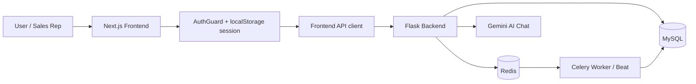
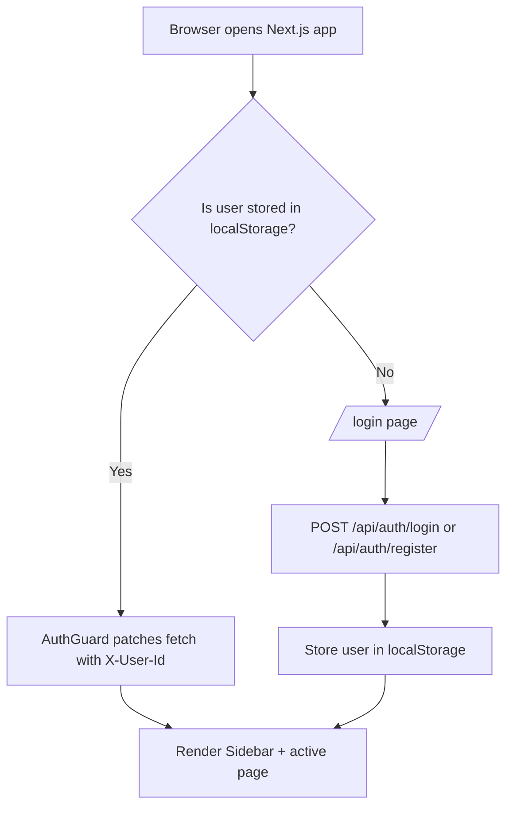
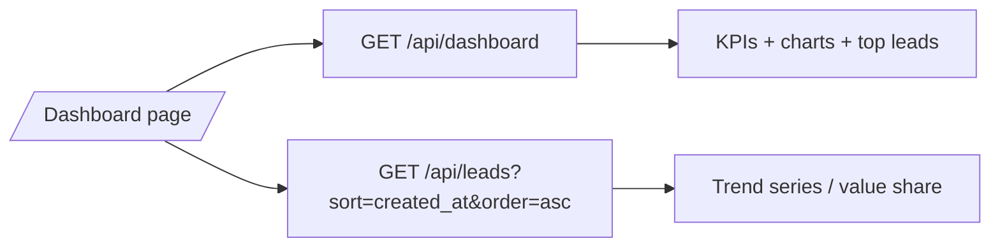
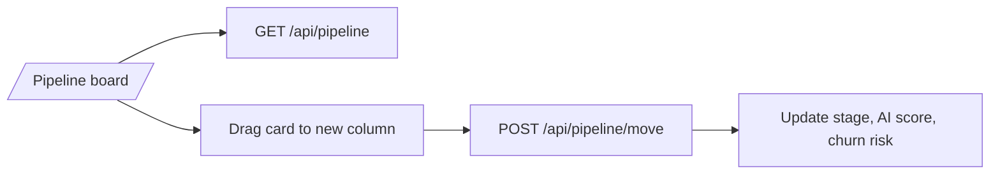
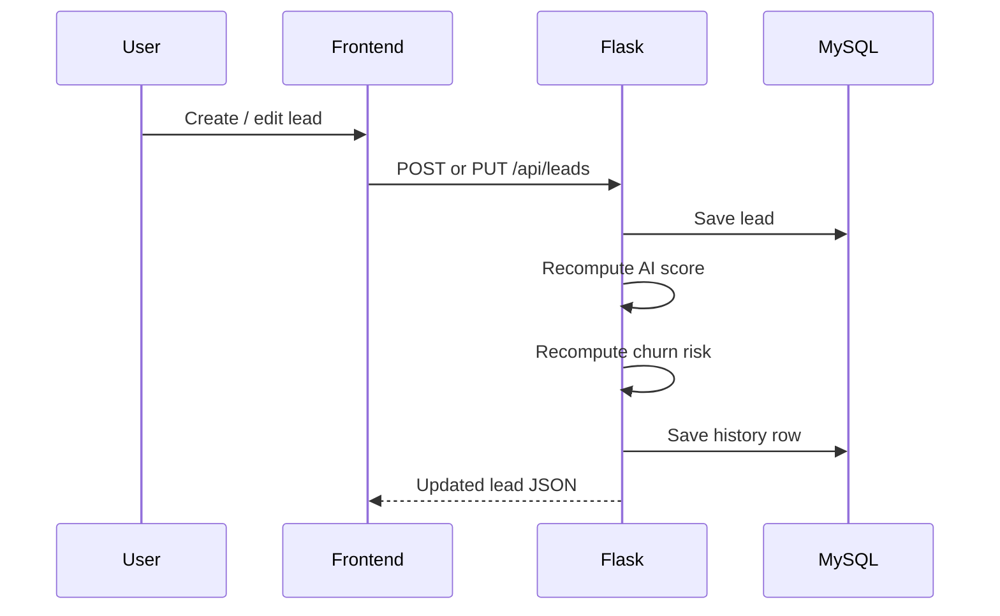
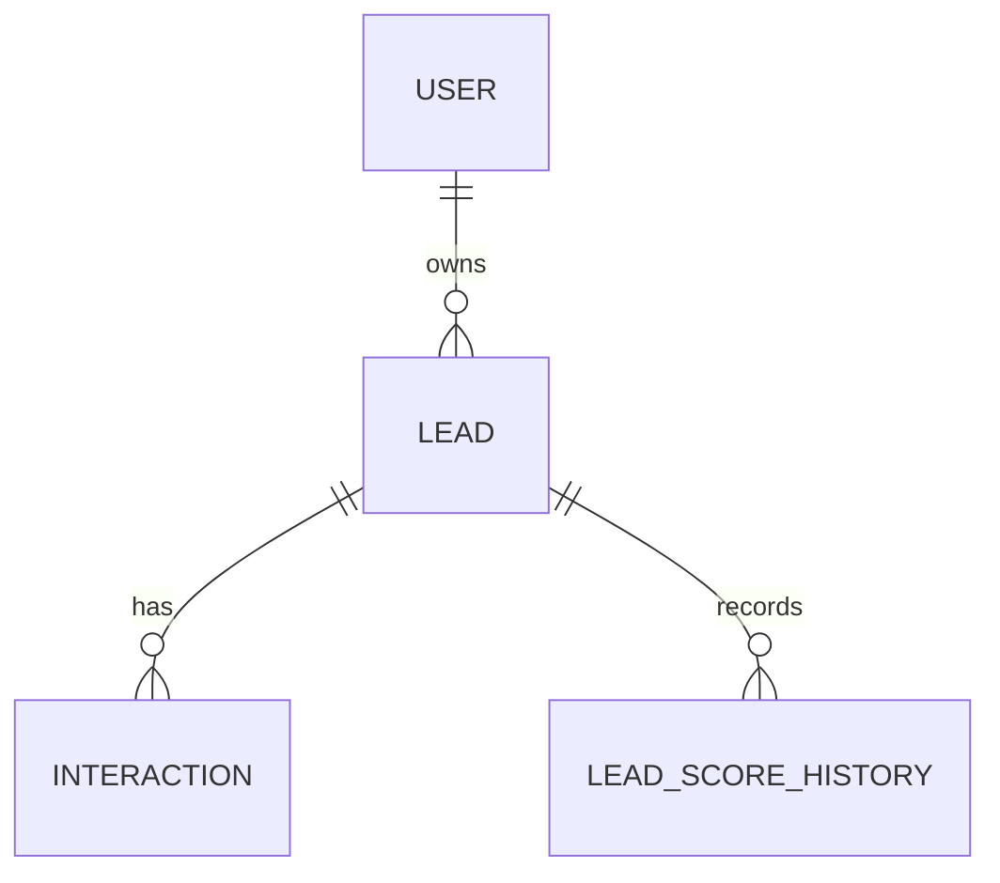

# NexCRM Project Flow

This document explains the end-to-end flow of the application so it can be used as the source for a project flow diagram.

## 1. System Overview

NexCRM is split into four major layers:

1. Next.js frontend for the user interface.
2. Flask backend for authentication, CRM APIs, and AI logic.
3. MySQL database for persistent CRM data.
4. Redis + Celery for background scoring, churn checks, and scheduled automation.

### High-Level Architecture

## 2. Startup Flow

### Backend startup

When `nexcrm-backend/app.py` starts, it:

1. Loads environment variables.
2. Configures Flask, SQLAlchemy, CORS, and Celery.
3. Creates database tables with `db.create_all()`.
4. Attempts to add the `user_id` column to existing leads for per-user isolation.
5. Ensures a default admin user exists.
6. Assigns any unowned leads to that admin account.
7. Starts the Flask server on port `5000`.

### Frontend startup

When the Next.js app starts, it:

1. Mounts the root layout.
2. Wraps every page with `AuthGuard`.
3. Redirects unauthenticated users to `/login`.
4. Reads the stored session from `localStorage`.
5. Patches `window.fetch` to automatically attach `X-User-Id` to API requests.
6. Renders the sidebar and active page for authenticated routes.

## 3. Authentication Flow

### Login and registration

The login page supports both sign-in and registration:

1. User enters email/password, or name/email/password for registration.
2. Frontend sends a POST request to `/api/auth/login` or `/api/auth/register`.
3. Backend validates the credentials or creates a new user.
4. Backend returns the user profile.
5. Frontend stores the user in `localStorage` under `nexcrm_user`.
6. The app redirects to `/`.

### Request authorization model

There is no JWT session in this project. Instead:

1. `AuthGuard` reads the stored user.
2. It injects the user id into every `fetch` request via the `X-User-Id` header.
3. Flask uses `get_user_id()` to scope CRM queries to that user.

This means most CRM routes are user-scoped by the header, not by a server-side session.

## 4. Page Flow

### 4.1 Dashboard (`/`)

Purpose: provide a quick operational view of the CRM.

Frontend flow:

1. Dashboard page loads `/api/dashboard` for KPIs and summary cards.
2. It also loads `/api/leads?sort=created_at&order=asc` for charting and trend calculations.
3. The UI renders pipeline value, closed value, conversion rate, at-risk count, sentiment split, and top leads.

Backend flow:

1. Flask queries all leads for the current user.
2. It calculates totals, conversion rate, sentiment distribution, stage distribution, top leads, and at-risk leads.
3. The response is returned as a dashboard summary payload.

### 4.2 Leads (`/leads`)

Purpose: manage lead records and inspect AI scores.

Frontend flow:

1. Page loads the lead list using filters for stage, sentiment, and sort order.
2. The search box filters the already loaded dataset locally.
3. Clicking `New Lead` opens the modal form.
4. Editing an existing row opens the same modal pre-filled.
5. Deleting a row calls the delete endpoint and removes it from the table.

Backend flow:

1. GET `/api/leads` returns only the current user’s leads.
2. POST `/api/leads` creates a new lead.
3. PUT `/api/leads/<id>` updates an existing lead.
4. DELETE `/api/leads/<id>` removes a lead.
5. After create or update, the backend recalculates AI score and churn risk.
6. Each score update is also written to `lead_score_history`.

### 4.3 Contact Detail (`/contacts`)

Purpose: inspect one lead deeply and log interactions.

Frontend flow:

1. The left pane lists contacts.
2. Selecting a contact loads the full lead detail with interaction history.
3. The detail panel shows stage, AI score, sentiment, churn risk, and timestamps.
4. The user can edit or delete the contact.
5. The user can log a new interaction with channel and note body.

Backend flow:

1. GET `/api/leads/<id>` returns the lead plus its interactions.
2. POST `/api/leads/<id>/interactions` saves the interaction.
3. The backend runs VADER sentiment analysis on the interaction body.
4. The lead sentiment, last_contacted timestamp, AI score, and churn risk are updated.

### 4.4 Pipeline (`/pipeline`)

Purpose: visualize and move leads across pipeline stages.

Frontend flow:

1. Page loads `/api/pipeline`.
2. The response groups leads into `Lead`, `Qualified`, `Proposal`, and `Closed` columns.
3. The user drags a card to a different column.
4. The UI updates locally for responsiveness.
5. The page sends the stage change to the backend.

Backend flow:

1. GET `/api/pipeline` returns grouped stage data with counts and total values.
2. POST `/api/pipeline/move` updates the lead stage.
3. The backend recalculates AI score and churn risk after the move.

### 4.5 Churn Risk (`/churn`)

Purpose: show the accounts most likely to disengage.

Frontend flow:

1. The page loads `/api/churn-risk`.
2. It renders a risk table with percentage bars.
3. Each row shows dormant days, sentiment, and value at risk.

Backend flow:

1. GET `/api/churn-risk` returns only leads where `churn_risk` is true.
2. Results are sorted by highest churn risk percentage first.

### 4.6 AI Assistant (`/assistant`)

Purpose: provide a conversational CRM copilot.

Frontend flow:

1. The page maintains the chat transcript in local component state.
2. The user enters a message or picks a quick query.
3. The frontend sends the message plus prior history to `/api/assistant/chat`.
4. The assistant response is appended to the conversation.

Backend flow:

1. Flask rebuilds live CRM context from the current user’s leads.
2. It includes top leads, at-risk accounts, stage, sentiment, and value information.
3. It passes that context to Gemini using `google.generativeai`.
4. Gemini returns a reply, which is sent back to the frontend.

## 5. Core CRM Data Flow

### Create lead

1. User submits the lead modal.
2. Frontend calls POST `/api/leads`.
3. Backend creates the row in MySQL.
4. Backend computes the initial AI score.
5. Backend computes the initial churn risk.
6. Backend persists the lead and score history.

### Update lead

1. User edits the lead modal.
2. Frontend calls PUT `/api/leads/<id>`.
3. Backend updates the mutable fields.
4. Backend recalculates score and churn risk.
5. Backend returns the updated lead payload to the UI.

### Log interaction

1. User enters an email/chat/call/note interaction.
2. Frontend calls POST `/api/leads/<id>/interactions`.
3. Backend stores the interaction row.
4. VADER classifies the sentiment as Positive, Neutral, or Negative.
5. Lead sentiment, last contact date, score, and churn risk are refreshed.

## 6. Background Automation Flow

Celery handles non-blocking and scheduled jobs.

### Scheduled jobs from `celerybeat`

1. Nightly refresh of lead scores.
2. Morning re-engagement email checks for dormant leads.
3. Six-hour churn risk recalculation.
4. Hourly sentiment aggregation for charts.

### Manual admin jobs

1. POST `/api/admin/refresh-scores` queues a score refresh task.
2. POST `/api/admin/trigger-reengagement` queues outbound emails.

### Worker behavior

1. `refresh_lead_scores` recalculates scores using the ML model in `ml_model.py`.
2. `refresh_churn_risk` re-evaluates dormant and negative leads.
3. `send_reengagement_emails` finds dormant leads and sends SMTP mail if configured.
4. `aggregate_sentiment_trends` stores cached trend data in Redis.

## 7. Scoring and Intelligence Flow

NexCRM uses two scoring paths:

1. Real-time scoring in Flask for user actions like create, update, interaction, and stage move.
2. Batch scoring in Celery for periodic ML-based recomputation.

### Real-time scoring

The synchronous scoring path in `app.py` is rule-based and uses:

1. Pipeline stage.
2. Deal value.
3. Recency of contact.
4. Sentiment.
5. Interaction count.

### Batch scoring

The background scoring path in `ml_model.py`:

1. Converts a lead into a feature vector.
2. Loads or trains a Gradient Boosting model.
3. Predicts a binned lead score.
4. Falls back to a rule-based estimate if the model is unavailable.

This is important for a diagram because the app has both a synchronous decision path and an asynchronous AI refresh path.

## 8. Data Model Relationships

The main data entities are:

1. `User` owns many leads.
2. `Lead` belongs to one user and owns many interactions.
3. `Interaction` belongs to one lead.
4. `LeadScoreHistory` belongs to one lead.

## 9. Recommended Diagram Nodes

If you are drawing a project flow diagram, use these node groups:

1. Entry and auth: Browser, Login Page, AuthGuard, Sidebar.
2. CRM screens: Dashboard, Leads, Contacts, Pipeline, Churn, Assistant.
3. API layer: `/api/auth/*`, `/api/leads/*`, `/api/dashboard`, `/api/pipeline`, `/api/churn-risk`, `/api/assistant/chat`.
4. Data layer: MySQL tables for users, leads, interactions, and score history.
5. Automation layer: Redis, Celery worker, Celery beat, SMTP, Gemini.

## 10. One-Line Flow Summary

User logs in -> frontend stores session -> authenticated pages send `X-User-Id` -> Flask scopes data to that user -> CRUD actions update MySQL -> score and churn logic recalculate -> Celery runs periodic refreshes and notifications -> Assistant and dashboard read the latest CRM state.
